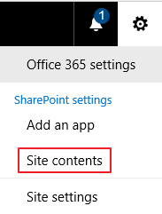
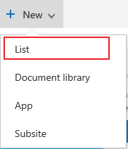
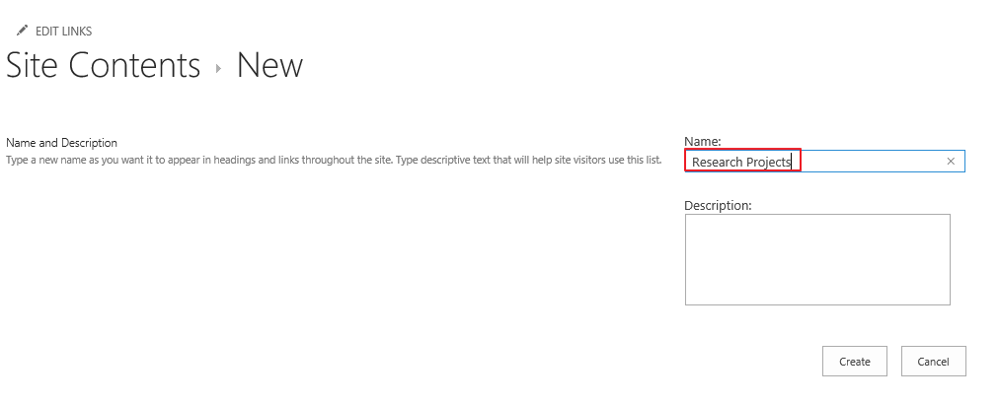
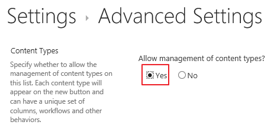
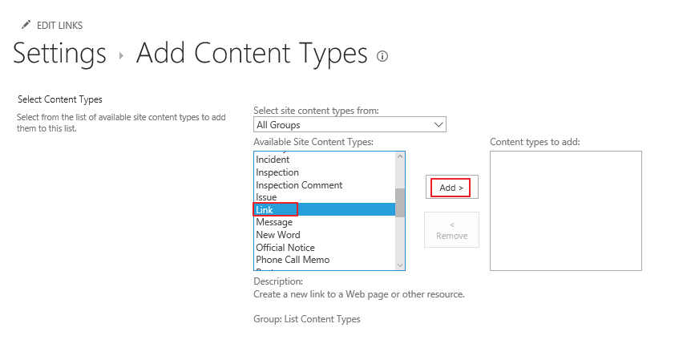
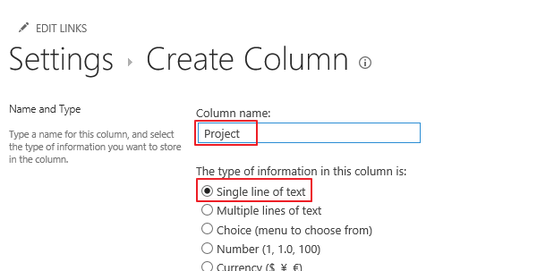
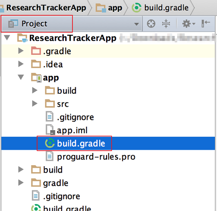
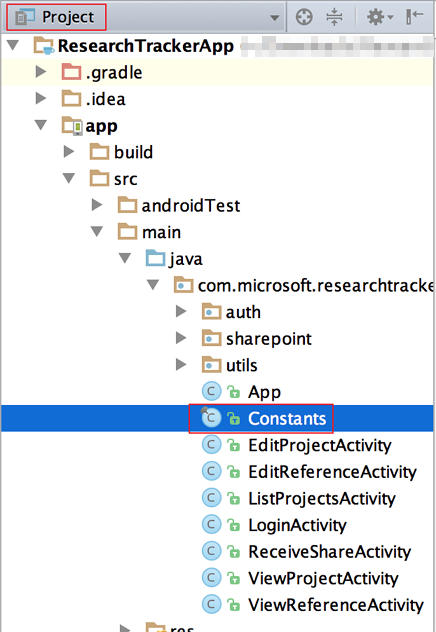

Calling the SharePoint Lists API with Android
=============================================

## Overview

SharePoint exposes a RESTful HTTP API for Lists which we can consume using the SharePoint Lists SDK for Android.

For more information on the API being consumed in this lab, see 
[the SharePoint Lists REST API documentation][docs-sharepoint-lists].

[docs-sharepoint-lists]: http://msdn.microsoft.com/en-us/library/office/dn531433(v=office.15).aspx

We'll examine the use of the Lists SDK by retrofitting an existing Android application with code to call the SharePoint Lists API. The app we'll be modifying is a modified version of the Research Tracker app, which can be found at [\\\O3654\O3654-4 Native Android Development with Office 365 APIs\05 O365 SharePoint Lists SDK\O365ResearchTrackerApp](O365ResearchTrackerApp).

## Objectives

-   Learn how to communicate with the SharePoint Lists API using the
    **SharePoint Lists SDK for Android**


## Prerequisites

-   [Git version control tool][git-scm]
-   [Android Studio][android-studio]
-   Android API Level 23 installed [using the Android SDK Manager][sdk-manager]
-   Complete the [\\\O3654\O3654-4 Native Android Development with Office 365 APIs\01 Azure AD Auth Prerequisites](../01%20Azure%20AD%20Auth%20Prerequisites) module.

[git-scm]: http://git-scm.com
[android-studio]: http://developer.android.com/sdk/installing/studio.html
[sdk-manager]: http://developer.android.com/tools/help/sdk-manager.html

## Exercises

The hands-on lab includes the following exercises:

-   [**Exercise 1**](#exercise1) Prepare the Research Tracker app
-   [**Exercise 2**](#exercise2) Implement the data functions

<a name="exercise1"></a>
## Exercise 1 - Prepare the Research Tracker app

In this exercise we will prepare a SharePoint site, and importing, configuring and preparing the Android
Research Tracker example app.

### Task 1 - Prepare SharePoint site

01. Login to a SharePoint online site with an account that has appropriate privileges to create lists.

02. Go to Site Contents.

	

03. Click New/List

	

04. Specify **Research Projects** as the Name of the new list. Click  the **Create** button.

	

05. Create another list named **Research References** the same way.

06. Go to the **Research References**list, click the **List** button, then click the **List Settings** button in the ribbon menu.
	
	

07. Click **Advanced Settings**.

08. Select **Yes** for the **Allow management of content types?** option. Click **OK** at the bottom of the page .

	

09. In the List Settings page, in the Content Types section, click **Add from existing site content types**.

	

10. In the Add Content Types page, select the **Link** Content Type, click **Add**, then click **OK**.

	

11. In the List Settings page, locate the Content Types section, click content type **Item**.

12. On the List Content Type page, click **Delete this content type**, then click **OK** on the confirm box.

09. On the List Settings page, click **Create Column**.

	

10. In the Create Column page, specify **Project** as the Column name. Select **Single line of text** as the Column type. Keep all other settings as default. Click **OK** at the page bottom.

	

15. Create some list items in the Research Projects list.
16. Create some list items in the Research References list.

### Task 2 - Import the Research Tracker app

01. Copy the Android Research Tracker app template [O365ResearchTrackerApp\src](.\O365ResearchTrackerApp\src) to a folder named "ResearchTrackerApp".

    You can do it in PowerShell by the following code(Please change the value of $lab_dir, $work_dir to the real path):

    ```powershell
    PS C:\> $lab_dir = ".\path\to\the\lab"
    PS C:\> $work_dir = ".\path\to\your\projects\dir"
    PS C:\> cp -Recurse "$lab_dir\O365ResearchTrackerApp\src\" "$work_dir\ResearchTrackerApp"
    ```

02. Launch Android Studio.

03. From the **File** menu, select **Import Project**.

    > **Note:** if this is your first time launching Android Studio, you may select **Import Project** from the Android Studio launcher.

04. Find and select the "ResearchTrackerApp" folder.

05. Click **OK** to import the project.

    

Wait for Android Studio to finish importing the test project.

We're not finished yet - the app is currently not compiling. Next we will add a reference to the Office 365 SharePoint Lists SDK.

### Task 3 - Add the Office 365 SharePoint Lists SDK

01. Open the `app/build.gradle` file.

	

02. Locate the `dependencies` section and add the following lines:
    
    ```groovy
    // SharePoint SDK
    compile 'com.microsoft.services:sharepoint-services:1.0.0'
    ```

    Note that the Lists SDK does not have a dependency on the "OData Engine"
    libraries which the other libraries in the Office 365 SDK for Android do.

    E.g.

    

03. Click **Sync Now**. This will sync the Android Studio project files with
    the Gradle build files.

    

In this task you added the SharePoint Lists SDK. The app is almost ready to go!

### Task 4 - Configure and test the app

01. Open the `app/src/main/java/com.microsoft.researchtracker/Constants.java` file.

	

02. This class hosts a number of static constants which we must update.

    -   **SHAREPOINT_URL**: Set this to the HTTPS url of the SharePoint instance you're using for the Research Tracker code sample

    -   **SHAREPOINT_SITE_PATH**: Set this to the Path of the SharePoint Site you're using for the Research Tracker code sample

    -   **AAD_CLIENT_ID**: Set to the Client ID obtained in the Prerequisites module

    -   **AAD_REDIRECT_URL**: Set to the Redirect URI configured in AD in the Prerequisites module

03. We're ready to test. You should the able to launch the app and sign in. Click **Run > Debug App** to launch the app. 

04. The app starts on the Launch screen. Click **Sign In** to sign in.
    
    

05. Sign in with a user from your tenancy who has access to your SharePoint site.

06. If you're able to sign in successfully, you will be greeted with a an error message: "There was an error while retrieving your projects".

    

    This is because all the data functions in this app are only stubbed out but they are not implemented yet.

The next exercise will step you through implementing the missing data functions using the Office 365 SharePoint Lists SDK.

<a name="exercise2"></a>
## Exercise 2 - Implement the data functions

In this exercise you will step through implementing the missing data functions in the `com.microsoft.researchtracker.sharepoint.data.ResearchDataSource` class using the Office 365 SharePoint Lists SDK.

### Task 1 - Configuring the data source class with an Access Token 

Before we do anything we must sort out authentication with the SharePoint Lists API and construct an instance of `import com.microsoft.services.sharepoint.ListClient`.

`ListClient` provides programmatic access to the SharePoint Lists API, and is part of the Lists SDK.

01. First, open the `sharepoint/data/ResearchDataSource.java` file. This and other source files can be found in the `app/src/main/java/com/microsoft/researchtracker/` folder.

    The ResearchDataSource class handles SharePoint communication for the entire app.

02. Replace the empty constructor at the top of the file with the following code:

    ```java
    private final ListClient mClient;
 
    public ResearchDataSource(ListClient client) {
        mClient = client;
    }
    ```

03. Next add **import** statements at the top of the file for any missing types. In this case you will need to add one for `ListClient`:

    ```java
    import com.microsoft.services.sharepoint.ListClient;
    ```

    You can use Android Studio's "Import Class" function to do this automatically 
    by placing the cursor on a missing type, pressing **Alt + Enter** and selecting **Import Class**

    

    Use this technique for any other missing types you encounter during this lab.

04. Open the file `App.java`. The App class provides some app-wide services.

05. Make sure you import the following class.

	```java
	import android.app.Application;
	import android.util.Log;
	
	import com.microsoft.researchtracker.auth.AuthManager;
	import com.microsoft.researchtracker.sharepoint.data.ResearchDataSource;
	import com.microsoft.services.sharepoint.ListClient;
	import com.microsoft.services.sharepoint.http.OAuthCredentials;
	``` 

05. Find the `getDataSource()` function. Replace the contents of this function
    with the following code:

    ```java
    String accessToken = mAuthManager.getAccessToken();

    ListClient client = new ListClient(
        Constants.SHAREPOINT_URL,
        Constants.SHAREPOINT_SITE_PATH,
        new OAuthCredentials(accessToken)
    );

    return new ResearchDataSource(client);
    ```

    This code retrieves an Access Token from the `AuthManager` and uses it to construct an instance of `ListClient`. The other arguments are constants you configured earlier in the lab.

    The `AuthManager` class handles authentication for this application (internally it uses the Active Directory Authentication Library).
    
With these small changes in place we can start to implement actual data functions in the app.

> **Note:** the `AuthManager.getAccessToken()` function will throw an unchecked exception if the user has not authenticated! Dealing with this problem is covered in the [\\\O3654\O3654-4 Native Android Development with Office 365 APIs\02 Active Directory Authentication Library](../02%20Active%20Directory%20Authentication%20Library) lab.

### Task 2 - Retrieving Research Projects list items

The first screen of the application - the "List Projects Activity" - uses only one function to source it's data. `ResearchDataSource.getResearchProjects()`. 

01. Open the file `sharepoint/data/ResearchDataSource.java` and find the `getResearchProjects()` function.

02. Delete the `throw new RuntimeException("Not Implemented");` expression.

03. We'll add the contents of this method piece by piece. Add the following block of code:

    ```java
    Query query = new Query().select(ResearchProjectModel.SELECT)
                             .expand(ResearchProjectModel.EXPAND);
    ```

    The **import** statement for the `Query` class is:

    ```java
    import com.microsoft.services.sharepoint.Query;
    ```

    The `Query` class provides a simple programmatic interface for building the OData queries we'll be sending to the SharePoint API.

    The statement above maps to the following OData query parameters:

    ```
    $select=Id,Title,Modified,Editor/Title&$expand=Editor
    ```

    The effect of these parameters is to specify which fields we want to retrieve from the SharePoint list. They are not required, but we are using them here specifically to retrieve the `Editor` property which is not included by default.

04. Add the following code:

    ```java
    List<SPListItem> items = mClient.getListItems(Constants.RESEARCH_PROJECTS_LIST, query).get();
    ```

    This line is doing all the hard work - building a query to the SharePoint API, awaiting the response and parsing the result.

    Ordinarily the `getListItems()` function is Asynchronous, but we are using the `get()` function to await the result synchronously. This means that we *cannot* call this function from the UI thread!

    Fortunately we know that all of the functions on this class will be called from a background thread, so we can implement these functions synchronously to simplify this example code.

05. Add the following code:

    ```java
    List<ResearchProjectModel> models = new ArrayList<ResearchProjectModel>();
    for (SPListItem item : items) {
        models.add(new ResearchProjectModel(item));
    }
    return models;
    ```

    This block transforms the `List<SPListItem>` into a `List<ResearchProjectModel>` and returns it.

    The `ResearchProjectModel` class wraps an SPListItem and provides strongly 
    typed access to the Fields we need: `Id`, `Title`, `Editor`, `Modified`.

06. That's all we need for the first screen of the app. Let's try it out. Click **Run > Debug App** to start the app in the debugger.
	> **Note:** If the **Research Projects** list contains nothing, you will see a blank list. Please go ahead till you can create projects. 

    (If you've already signed in before you should be signed in automatically.)

    

### Task 3 - Retrieving a single Research Project (and its References)

The second screen of the application - the "View Project Activity" - needs two functions to load: `getResearchProjectById()` and `getResearchReferencesByProjectId()`.

01. Open the file `sharepoint/data/ResearchDataSource.java` and find the `getResearchProjectById()` function.

02. Delete the `throw new RuntimeException("Not Implemented");` expression.

03. Add the following code:
    
    ```java
    Query query = new Query().select(ResearchProjectModel.SELECT)
                             .expand(ResearchProjectModel.EXPAND);

    //TODO: add filter clause here

    List<SPListItem> items = mClient.getListItems(Constants.RESEARCH_PROJECTS_LIST, query).get();

    if (items.size() == 0) {
        return null;
    }

    return new ResearchProjectModel(items.get(0));
    ```

    This code is fairly self explanatory - you will recognize most of the code from the last task.

    This function returns only a single `ResearchProjectModel`, so lets add the filtering code.

04. Replace the comment `//TODO: add filter clause here` with the following code:

    ```java
    query.field("Id").eq().val(projectId);
    ```

    This expression modifies the `query` variable to with an  *OData filter expression*. Specifically - it generates an OData query something like:

    ```
    $select=Id eq 9
    ```

05. Next, find the `getResearchReferencesByProjectId()` function.

06. Delete the `throw new RuntimeException("Not Implemented");` expression.

07. And add the following code:

    ```java
    Query query = new Query().select(ResearchReferenceModel.SELECT)
                             .expand(ResearchReferenceModel.EXPAND);

    query.field("Project").eq().val(projectId);

    List<SPListItem> items = mClient.getListItems(Constants.RESEARCH_REFERENCES_LIST, query).get();

    List<ResearchReferenceModel> models = new ArrayList<ResearchReferenceModel>();
    for (SPListItem item : items) {
        models.add(new ResearchReferenceModel(item));
    }
    return models;
    ```

    You've see this pattern before - but there are some notable differences:

    -   Here we're retrieving Research References, so we're using the 
        appropriate `ResearchReferenceModel` class and RESEARCH_REFERENCES list name.
    -   We're filtering on the "Project" field.

08. Let's try it out. Click **Run > Debug App** to start the app in the debugger.

09. Pick one of the Research Projects in the list to go to the View Project activity. Here you can see details about the Project and its References. 
	> **Note:** If the **Research Projects** or **Research References** list contain nothing, you will see a blank project list or blank reference list of the selected project. Please go ahead till you can create project and reference.

    

This task introduced building Filter expressions using the `Query` class. We don't really exercise it much here - but it can be used to build complex expressions like the following:

```java
//$select=Number lt 100
Query query1 = new Query().field("Number").lt().val(100);

//$filter=endsWith(Title, 'the end')
Query query2 = new Query().endsWith("Title", "the end");
```

The `QueryOperations` class gives access to some of these functions in a static context, which can make building complex nested expressions fairly concise:

```java
import com.microsoft.services.sharepoint.QueryOperations.*;

//$filter=Age gt 31 and (concat(FirstName, LastName) eq 'JohnSmith')
Query query3 = field("Age").gt().val(31).and(
        concat(field("FirstName"), field("LastName")).eq().val("JohnSmith")
);
```

### Task 4 - Retrieving a single Reference

The third screen of the application - the "View Reference Activity" - needs just one function to load: `getResearchReferenceById()`.

01. Open the file `sharepoint/data/ResearchDataSource.java` and find the `getResearchReferenceById()` function.

02. Delete the `throw new RuntimeException("Not Implemented");` expression.

03. Add the following code:

    ```java
    Query query = new Query().select(ResearchReferenceModel.SELECT)
                             .expand(ResearchReferenceModel.EXPAND);

    query.field("Id").eq().val(referenceId);

    List<SPListItem> results = mClient.getListItems(Constants.RESEARCH_REFERENCES_LIST, query).get();

    if (results.size() == 0) {
        return null;
    }

    return new ResearchReferenceModel(results.get(0));
    ```

04. Let's try it out. Click **Run > Debug App** to start the app in the debugger.

05. Pick one of the Research Projects in the list to go to the View Project activity.

06. Pick a Reference from the list to go to the View Reference activity. Here you can see details about the reference including a Url which will launch the system web browser when tapped by the user.
    > **Note:** If the **Research Projects** or **Research References** list contain nothing, you will be able to do this. Please go ahead till you can create project and reference.

    

### Task 5 - Modifying a Research Project

If you've clicked around the app a little, you will have noticed that we have the ability to edit and create Projects and References.

In this task we'll implement the data functions required to **create**, **edit** and **delete** a Project list item.

01. Open the file `sharepoint/data/ResearchDataSource.java` and find the `deleteResearchProject()` function.

02. Delete the `throw new RuntimeException("Not Implemented");` expression and add the following code:

    ```java
    SPListItem item = new SPListItem();
    item.setData("Id", projectId);

    mClient.deleteListItem(item, Constants.RESEARCH_PROJECTS_LIST).get();
    ```

    The `deleteListItem()` function requires that we provide an `SPListItem` object, so this code creates one and sets its Id field.

    As usual the call is asynchronous, so we're awaiting the result synchronously using a call to `get()`.

03. Find the `createResearchProject()` function.

04. Delete the `throw new RuntimeException("Not Implemented");` expression and add the following code:

    ```java
    SPList list = mClient.getList(Constants.RESEARCH_PROJECTS_LIST).get();

    mClient.insertListItem(model.getData(), list);
    ```

    This function makes two API calls:

    -   One to retrieve metadata about the List
    -   One to create the new list item

    The `ResearchProjectModel.getData()` function returns the `SPListItem` object which the model class uses internally to store its state.

05. Find the `updateResearchProject()` function.

06. Delete the `throw new RuntimeException("Not Implemented");` expression and add the following code:

    ```java
    SPList list = mClient.getList(Constants.RESEARCH_PROJECTS_LIST).get();

    mClient.updateListItem(model.getData(), list);
    ```

07. We're ready to test these changes. Click **Run > Debug App** to start the app in the debugger.

08. First let's create a new Project. Click the **Add** in the action bar.
    
    

09. Fill out a new Project name, and click **Ok**.

    

10. The project is created an you are returned to the project list. Find your project in the list and tap on it.

    

10. Select **Edit** in the action bar.

    

11. Enter a new name and click **Ok**.

    

12. Finally, select **Delete** in the action bar. When prompted, select **Delete** again to confirm.

    

    

In this task you implemented the boilerplate code required to **create**, 
**edit** and **delete** a Project list item.

### Task 6 - Modifying a Research Reference

In this task we'll implement the data functions required to **create**, **edit** and **delete** a Reference list item.

01. Open the file `sharepoint/data/ResearchDataSource.java` and find the `deleteResearchReference()` function.

    Delete the `throw new RuntimeException("Not Implemented");` expression and add the following code:

    ```java
    SPListItem token = new SPListItem();
    token.setData("Id", referenceId);

    mClient.deleteListItem(token, Constants.RESEARCH_REFERENCES_LIST);
    ```

02. Find the `createResearchReference()` function.

    Delete the `throw new RuntimeException("Not Implemented");` expression and add the following code:

    ```java
    SPList list = mClient.getList(Constants.RESEARCH_REFERENCES_LIST).get();

    mClient.insertListItem(model.getData(), list);  
    ```

03. Find the `updateResearchReference()` function.

    Delete the `throw new RuntimeException("Not Implemented");` expression and add the following code:

    ```java
    SPList list = mClient.getList(Constants.RESEARCH_REFERENCES_LIST).get();

    mClient.updateListItem(model.getData(), list);
    ```

04. We're ready to test these changes. Click **Run > Debug App** to start the app in the debugger.

05. Pick one of the Research Projects in the list to go to the View Project activity.

06. First lets create a new Reference. Click **Add** in the action bar.

    

07. Fill out the form. Only the **Url** field is required. Click **Ok** to save the changes.
    
    

08. Select the reference you just created from the list.
    
    

09. Select **Edit** from the action bar.

    

10. Make a change to the reference and click **Ok** to save the changes.
    
    

11. Finally, select **Delete** from the action bar. When prompted, click **Delete** again to confirm.

    

    

In this task you implemented the boilerplate code required to **create**, **edit** and **delete** a Reference list item.

## Conclusion

You've now got a fully working version of the Android Research Tracker app.

By completing this hands-on lab you have learned:

1.  How to add the Office 365 SharePoint Lists SDK to an Android project.
2.  How to query for lists
3.  How to query for list items
4.  How to create, read, update and delete list items

As a final exercise, please try out the **Sharing** functionality built into the Research Tracker app. To start, launch the Android web browser, navigate to a web page and click **Share** from the menu.